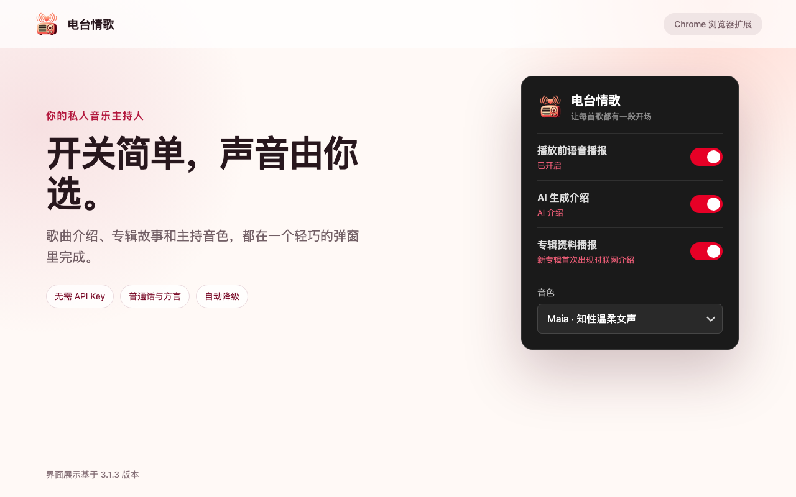
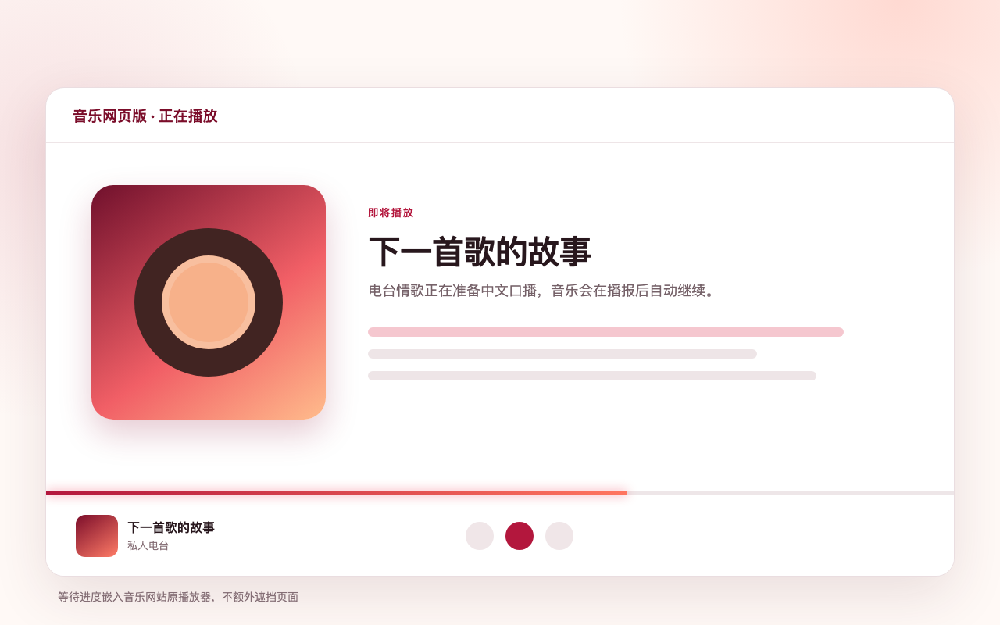
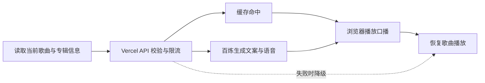

<p align="center">
  
</p>

<h1 align="center">电台情歌</h1>

<p align="center">
  <strong>让每首歌，都有一段开场。</strong>
</p>

<p align="center">
  把网易云音乐和 QQ 音乐的网页歌单，变成一档带中文口播串场的私人电台。
</p>

<p align="center">
  <a href="https://jackyrwj.github.io/song2radio/">官方网站</a> ·
  <a href="#5-分钟开始使用">快速开始</a> ·
  <a href="https://jackyrwj.github.io/song2radio/support.html">帮助与支持</a> ·
  <a href="https://jackyrwj.github.io/song2radio/privacy.html">隐私政策</a>
</p>

<p align="center">
  <a href="https://github.com/jackyrwj/song2radio/actions/workflows/validate.yml"></a>
  
  
</p>

歌单很好，但歌曲之间常常切换得太快。电台情歌会在每首歌播放前短暂停一下，用自然的中文口播介绍接下来要听的作品，再自动恢复播放。它像一个轻量的小 DJ，又不会改变你原来的听歌习惯。

- **打开歌单就能用**：支持网易云音乐和 QQ 音乐网页版，不需要迁移歌单。
- **不需要填写 API Key**：AI 文案、资料查询和云端语音由配套服务提供。
- **服务失败不阻塞音乐**：接口超时或额度不足时自动降级为简单文案或系统语音。
- **数据用途透明**：只处理生成口播所需的歌曲、歌手和专辑信息；详见[隐私政策](https://jackyrwj.github.io/song2radio/privacy.html)。

> [!NOTE]
> 项目目前尚未上架 Chrome Web Store，请通过仓库中的扩展包或源码手动安装。

## 使用预览

<table>
  <tr>
    <td align="center"></td>
    <td align="center"></td>
  </tr>
  <tr>
    <td align="center">按需要选择播报内容和主持音色</td>
    <td align="center">在原播放器进度条中查看准备状态</td>
  </tr>
</table>

## 为什么使用电台情歌

| 能力 | 你得到什么 |
| --- | --- |
| 歌曲口播 | 播放前自动介绍歌名、歌手和专辑，不用分心查看页面 |
| 专辑故事 | 新专辑本次首次出现时，可补充发行背景、风格和影响 |
| 电台式流程 | 第一首有开场白，最后一首有收尾语，歌单更像一档完整节目 |
| 多种主持音色 | 可选择普通话和方言云端音色，默认使用 Maia |
| 原生进度反馈 | 等待 AI 文案或专辑资料时，直接在音乐网站的进度条中显示状态 |
| 自动降级 | AI 或语音服务不可用时继续播放，不让外部服务卡住播放器 |
| 服务端密钥 | 供应商 API Key 只保存在服务端，不会进入扩展或浏览器存储 |
| 双平台适配 | 同时支持网易云音乐网页版和 QQ 音乐网页版 |

## 5 分钟开始使用

### 前置条件

- Chrome、Edge 或其他支持 Manifest V3 的 Chromium 浏览器
- 能正常使用的[网易云音乐网页版](https://music.163.com/)或 [QQ 音乐网页版](https://y.qq.com/)

### 1. 获取扩展

选择一种方式：

- 下载仓库中的 [`diantai-qingge-extension.zip`](diantai-qingge-extension.zip) 并解压；或
- 克隆仓库，直接使用 `netease-intro-extension/` 源码目录。

```bash
git clone https://github.com/jackyrwj/song2radio.git
cd song2radio
```

### 2. 加载扩展

1. 打开 `chrome://extensions/`；Edge 用户打开 `edge://extensions/`。
2. 开启右上角的「开发者模式」。
3. 点击「加载已解压的扩展程序」。
4. 选择解压后的目录，或仓库中的 `netease-intro-extension/`。

浏览器工具栏中出现「电台情歌」图标即表示安装成功。

### 3. 开始播放

打开网易云音乐或 QQ 音乐网页版，像平时一样播放歌单。切换到新歌时，扩展会暂停音乐、准备并播报介绍，然后自动继续播放。

如果刚安装后没有生效，请刷新音乐页面；仍未生效时，在扩展程序页面点击一次「重新加载」。

## 设置

点击浏览器工具栏中的扩展图标即可调整：

| 设置 | 作用 |
| --- | --- |
| 播放前语音播报 | 总开关；关闭后音乐网站恢复原样 |
| AI 生成介绍 | 开启后生成自然串场；关闭后使用“歌曲名 + 歌手名”简单模板 |
| 专辑资料播报 | 同一张专辑本次首次出现时，查询资料并生成专辑介绍 |
| 音色 | 选择云端主持音色；服务异常时自动使用系统语音兜底 |

推荐日常配置：开启前三项，音色选择 `Maia · 知性温柔女声`。偏好新闻电台风格时，可以尝试 `Neil · 新闻主持男声`。

## 工作原理



- 扩展负责识别切歌、读取必要的曲目信息、展示准备进度并控制暂停与恢复。
- Vercel 接口负责输入校验、缓存、调用频率和全局预算限制。
- Upstash Redis 保存限流计数与生成结果缓存；百炼负责生成文案、联网查询和云端语音。
- 客户端会为每次安装生成随机匿名标识，仅用于限流，不包含音乐账号或完整播放历史。
- 接口只接受受限的歌曲字段和预定义音色，不接受任意 prompt，也不会向客户端返回供应商 Key。

## 项目结构

```text
api/
  intro.js                文案与 TTS 服务接口
  health.js               部署配置健康检查
lib/server/
  song2radio.js           输入校验、模型、联网查询与 TTS
  rate-limit.js           Upstash Redis 限流与预算控制
netease-intro-extension/
  manifest.json           Manifest V3 扩展配置
  background.js           调用 Song2Radio 服务
  popup.html / popup.js   设置弹窗
  bridge.js               页面与扩展后台之间的消息桥
  intercept.js            播放拦截与口播流程
  adapters/
    netease.js            网易云音乐适配器
    qq.js                 QQ 音乐适配器
test/                     服务端与扩展自动化测试
docs/                     官网、隐私政策与帮助页面
store-assets/             Chrome Web Store 展示素材
```

## 本地开发

扩展没有构建步骤，`netease-intro-extension/` 就是可加载的扩展源码。服务端使用 Node.js 24 LTS。

```bash
git clone https://github.com/jackyrwj/song2radio.git
cd song2radio
npm ci
npm run check
```

`npm run check` 会运行 Node.js 测试和扩展完整性校验。GitHub Actions 还会检查扩展 JavaScript 语法，并生成可供下载的 zip 构建产物。

修改扩展后，在 `chrome://extensions/` 点击「重新加载」，再刷新音乐页面即可测试。提交前请确认没有把 API Key 或其他密钥写入代码、日志或截图。

## 部署配套服务

普通用户不需要部署服务。本节仅适用于希望运行自己后端的开发者。

### 前置条件

- Vercel 项目
- 阿里云百炼 `DASHSCOPE_API_KEY`
- Upstash Redis（可通过 Vercel Marketplace 创建）

### 部署

```bash
npm install
vercel login
vercel link
vercel env add DASHSCOPE_API_KEY
vercel env add RATE_LIMIT_SALT
vercel --prod
```

Upstash 集成需要提供以下任意一组变量：

```text
KV_REST_API_URL + KV_REST_API_TOKEN
UPSTASH_REDIS_REST_URL + UPSTASH_REDIS_REST_TOKEN
```

部署后检查：

```bash
curl https://your-domain.example/api/health
```

只有返回 `status: ok` 时服务才可用。如果域名不是默认的 `https://song2radio.vercel.app`，还需要同步修改：

- `netease-intro-extension/background.js` 中的 `SERVICE_ENDPOINT`
- `netease-intro-extension/manifest.json` 中的 `host_permissions`

可用 `HOURLY_IP_LIMIT`、`DAILY_INSTALL_LIMIT`、`DAILY_ALBUM_LIMIT` 和 `GLOBAL_DAILY_LIMIT` 调整调用限制。设置 `ENABLE_CLOUD_TTS=false` 可以紧急关闭云端语音，同时保留文案和系统语音降级。

## 常见问题

<details>
<summary><strong>没有播报怎么办？</strong></summary>

先确认「播放前语音播报」已开启，然后刷新网易云音乐或 QQ 音乐页面。如果仍未生效，请在 `chrome://extensions/` 中确认扩展已启用并点击「重新加载」。
</details>

<details>
<summary><strong>为什么只有简单播报或系统音色？</strong></summary>

共享 AI 或语音服务可能暂时不可用、达到调用限制，或者你关闭了「AI 生成介绍」。扩展会自动降级，避免中断音乐播放。
</details>

<details>
<summary><strong>为什么同一张专辑不会重复介绍？</strong></summary>

为减少打断，同一播放会话中，一张专辑通常只在第一次出现时介绍。
</details>

<details>
<summary><strong>QQ 音乐为什么比网易云音乐更容易受页面更新影响？</strong></summary>

QQ 音乐的不同页面使用不同播放器结构，切歌时曲目信息、按钮状态和真实媒体播放不一定同步，因此适配器同时使用媒体播放拦截和 DOM 观察。网站更新后如果失效，请[提交问题](https://github.com/jackyrwj/song2radio/issues/new?template=bug-report.md)。
</details>

## 文档导航

| 想做什么 | 阅读 |
| --- | --- |
| 了解产品 | [官方网站](https://jackyrwj.github.io/song2radio/) |
| 排查安装或播放问题 | [帮助与支持](https://jackyrwj.github.io/song2radio/support.html) |
| 了解数据处理方式 | [隐私政策](https://jackyrwj.github.io/song2radio/privacy.html) |
| 报告功能或适配问题 | [问题反馈](https://github.com/jackyrwj/song2radio/issues/new?template=bug-report.md) |
| 提交隐私请求 | [隐私请求](https://github.com/jackyrwj/song2radio/issues/new?template=privacy-request.md&labels=privacy) |
| 准备 Chrome Web Store 材料 | [上架填写稿](STORE_LISTING.md) |
| 查看部署状态 | [服务健康检查](https://song2radio.vercel.app/api/health) |

## 路线图

- [x] 网易云音乐网页版适配
- [x] QQ 音乐网页版适配
- [x] AI 歌曲口播、专辑资料与云端 TTS
- [x] 服务端输入校验、缓存与多层限流
- [x] 自动化测试、扩展校验与 CI 打包
- [x] 官网、支持页面与隐私政策
- [ ] 完成首次使用数据披露与主动同意流程
- [ ] 提交 Chrome Web Store 审核
- [ ] 持续跟进音乐网站页面更新与兼容性

## 参与贡献

欢迎提交问题、适配修复和体验改进：

1. 开始修改前先搜索[现有 Issues](https://github.com/jackyrwj/song2radio/issues)，避免重复工作。
2. 修复问题时请说明浏览器版本、音乐平台和复现步骤。
3. 提交 Pull Request 前运行 `npm run check`，并在 Chrome 或 Edge 中手动验证相关播放流程。
4. 不要提交账号密码、Cookie、API Key、`.env` 文件或其他敏感信息。

## 许可证

本仓库目前尚未添加开源许可证。在许可证明确前，源代码默认保留所有权利；如需复制、修改、分发或商用，请先联系维护者取得许可。

## 说明

这个项目主要用于个人学习。公开提供共享 AI 与语音服务时，请设置合理的限流、预算告警和 Vercel 防火墙规则，并留意百炼、Vercel 与 Upstash 的计费和服务条款。

## 支持项目

如果电台情歌让你的听歌体验更有趣，欢迎请我喝杯咖啡，支持项目继续维护。

<p align="center">
  
</p>
